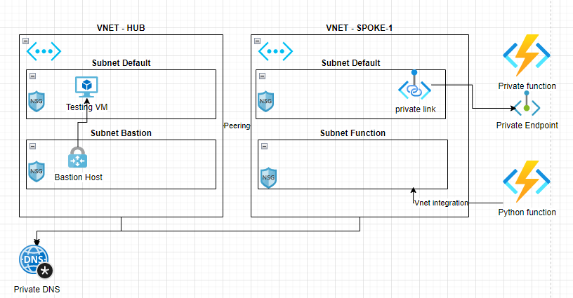

# azure-terraform-private-functions
Terraforming azure functions with private endpoints and vnet integration including Python V2 function to test

## Quick Installation instructions
* `cd terraform`
* `terraform init`
* `terraform apply -var environment=abc` (random 3-5 letters)
* (After Terraform has finished, make note of the ouput 'function-app-name')
* `cd ../python-function`
* `func azure functionapp fetch (func-app-name from terraform output)`
* `func azure functionapp publish (func-app-name from terraform output)`

Your function should now be deployed. Check the details from azure-portal.
The url should be `https://(func-app-name from terraform output).azurewebsites.net/api/test` (but you need to get the api-key from the  portal)

### Troubleshooting:
* If the function does not work, check if the build did something (or failed) from portal / function / Deployment center / logs. Sometimes it does not run the Oryx build if the function is fresh. Rerun the functionapp publish part.

Note: The test VM is disabled by default, deploy it with   `terraform apply -var environment=abc -var deploy_test_vm=true`

# Terraforming
Please run the terraform code in terraform directory to setup the environment.
The name of the function needs to be globally unique. You can use terraform workspace or variable 'environment' to setup a unique identifier (not the full name, just random 3-5 letters).

The infra has 2 functions
* A private function that cannot be reached from internet (based on docker image)
* A public function that is vnet integrated and able to call the private function (Python v2 function, source-code in the python-function folder).

There is a hub-spoke network setup, where the hub has a test VM you can use to connect the private function. The functions are deployed in to the peer.
For simplicity all of this runs in same region.

# The Function

It is using new V2 version of python functions, see https://learn.microsoft.com/en-us/azure/azure-functions/functions-reference-python

To run the function locally, you need to grant yourself IAM permission of Storage Blob Data Contributor for the storage account of the function from the portal (created by terraform earlier)

Deploy with a remote (pip) build `func azure functionapp publish my-function-name`

Deploy with a local (pip) build `func azure functionapp publish my-function-name --build local`

To run locally, pull the remote configuration `func azure functionapp fetch my-function-name` and then `func start`

However it should return error page from when calling the private function (html)
